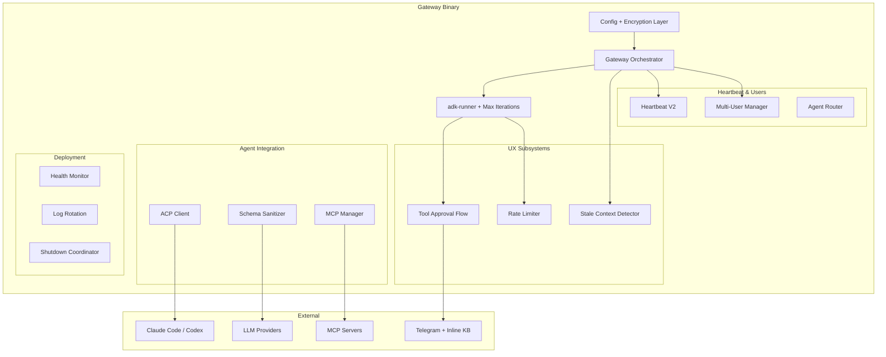

# Design Document: Phase 2 Complete

## Overview

Phase 2 transforms the adk-gateway from a working prototype into a production-ready system. This design covers 14 requirements spanning UX polish (tool approval, stale context detection), architectural corrections (provider-aware schema sanitization, runner configurability), external agent integration (ACP), improved heartbeat semantics, multi-user support, and deployment hardening (Docker, systemd, health monitoring, log rotation, zero-downtime restarts, config encryption).

The design maintains the existing architecture: a single Rust binary with embedded React UI, axum web framework, tokio async runtime, DashMap for concurrent state, and SQLite for persistence. New subsystems are added as modules that integrate with the existing `GatewayState`, `ShutdownCoordinator`, and message processing pipeline.

## Architecture



### Key Architectural Decisions

1. **Tool Approval as Runner Middleware**: The approval flow intercepts tool execution within the Runner loop rather than at the channel layer, ensuring all tool calls (regardless of source) go through approval.

2. **Schema Sanitization at Model Invocation Time**: Schemas are stored in their original form and transformed lazily per-provider, avoiding data loss and enabling multi-provider support from the same tool definitions.

3. **Heartbeat V2 as Session-Integrated**: Moving heartbeat from isolated cron jobs to session-integrated execution gives the heartbeat full conversation context for meaningful alerts.

4. **Multi-User via Per-User Session Isolation**: Each paired user gets an independent session, heartbeat schedule, and delivery target, using the existing `DashMap<UserId, Session>` pattern.

5. **Config Encryption with `enc:` Prefix**: Allows gradual migration — plaintext and encrypted values coexist in the same config file.

## Components and Interfaces

### 1. Tool Approval Flow (`src/tool_approval.rs`)

```rust
/// Classification of whether a tool requires approval.
pub enum ApprovalDecision {
    Required,
    NotRequired,
}

/// State machine for a pending approval.
pub enum ApprovalState {
    Pending { expires_at: Instant },
    Approved,
    Rejected,
    TimedOut,
}

/// Configuration for tool approval rules.
pub struct ApprovalConfig {
    /// Tool name patterns that require approval (glob-style).
    pub require_approval: Vec<String>,
    /// Timeout in seconds before auto-reject (default: 120).
    pub timeout_secs: u64,
}

pub trait ToolApprovalService: Send + Sync {
    /// Determine if a tool call requires approval.
    fn requires_approval(&self, tool_name: &str, config: &ApprovalConfig) -> ApprovalDecision;
    
    /// Request approval from the user, returning a oneshot receiver for the result.
    async fn request_approval(
        &self,
        tool_name: &str,
        tool_args: &serde_json::Value,
        user_id: &str,
    ) -> Result<tokio::sync::oneshot::Receiver<ApprovalState>, anyhow::Error>;
    
    /// Handle a callback from an inline button press.
    async fn handle_callback(&self, callback_id: &str, approved: bool) -> Result<(), anyhow::Error>;
}
```

**Default approval categories:**
- `fs_write`, `fs_delete`, `fs_move` — file write/destructive operations
- `shell_exec`, `run_command` — shell execution
- `kg_delete_*` — destructive KG operations

### 2. Stale Context Detector (`src/stale_context.rs`)

```rust
pub struct StaleContextConfig {
    /// Idle threshold in seconds (default: 4 hours = 14400).
    pub idle_threshold_secs: u64,
}

pub struct StaleContextDetector {
    config: StaleContextConfig,
}

impl StaleContextDetector {
    /// Check if the user's session is stale based on last activity.
    pub fn is_stale(&self, last_activity: DateTime<Utc>, now: DateTime<Utc>) -> bool;
    
    /// Build the welcome-back message content.
    pub fn build_welcome_back(
        &self,
        idle_duration: Duration,
        pending_tasks: &[PendingTaskResult],
        heartbeat_alerts: &[HeartbeatAlert],
    ) -> String;
}
```

### 3. Rate Limiter (`src/rate_limiter.rs`)

```rust
pub struct RateLimitConfig {
    /// Maximum tool calls within the window (default: 10).
    pub max_calls: u32,
    /// Sliding window duration in seconds (default: 5).
    pub window_secs: u64,
    /// Cooldown pause duration in seconds (default: 3).
    pub cooldown_secs: u64,
    /// Max triggers before termination (default: 3).
    pub max_triggers: u32,
}

pub struct RateLimiter {
    /// Per-request state: timestamps of recent tool calls.
    window: VecDeque<Instant>,
    trigger_count: u32,
    config: RateLimitConfig,
}

pub enum RateLimitDecision {
    Allow,
    Pause { duration: Duration },
    Terminate { reason: String },
}

impl RateLimiter {
    /// Record a tool invocation and return the rate limit decision.
    pub fn record_invocation(&mut self, tool_name: &str, now: Instant) -> RateLimitDecision;
    
    /// Get the current count within the sliding window.
    pub fn window_count(&self, now: Instant) -> u32;
}
```

### 4. ACP Integration (`src/acp.rs`, feature-gated)

```rust
#[cfg(feature = "acp")]
pub struct AcpConfig {
    pub endpoint: String,
    pub timeout_secs: u64,  // default: 300
    pub agent_type: AcpAgentType,
}

#[cfg(feature = "acp")]
pub enum AcpAgentType {
    ClaudeCode,
    Codex,
    Custom { name: String },
}

#[cfg(feature = "acp")]
pub struct AcpTool {
    config: AcpConfig,
    client: reqwest::Client,
}

#[cfg(feature = "acp")]
impl AcpTool {
    pub async fn execute(
        &self,
        task: &str,
        file_context: Option<&[PathBuf]>,
        progress_tx: mpsc::Sender<String>,
    ) -> Result<AcpResult, AcpError>;
}
```

### 5. Schema Sanitizer (`src/schema_sanitizer.rs`)

```rust
/// Provider-specific schema transformation.
pub trait SchemaSanitizer: Send + Sync {
    /// Transform a JSON Schema for this provider. Returns the original if no changes needed.
    fn sanitize(&self, schema: &serde_json::Value) -> serde_json::Value;
}

/// Gemini-specific sanitizer that removes/transforms unsupported properties.
pub struct GeminiSanitizer;

/// Identity sanitizer for providers that accept standard JSON Schema (OpenAI, Anthropic).
pub struct IdentitySanitizer;

impl SchemaSanitizer for GeminiSanitizer {
    fn sanitize(&self, schema: &serde_json::Value) -> serde_json::Value {
        // - Remove: propertyNames
        // - Convert: exclusiveMinimum:N → minimum:N+1 (integer)
        // - Convert: exclusiveMaximum:N → maximum:N-1 (integer)
        // - Convert: type:["string","null"] → type:"string", nullable:true
        // - Convert: items (array) → items (first element)
    }
}

impl SchemaSanitizer for IdentitySanitizer {
    fn sanitize(&self, schema: &serde_json::Value) -> serde_json::Value {
        schema.clone()
    }
}
```

### 6. Runner Max Iterations

Extends the existing `RunnerConfig` in adk-runner:

```rust
/// Gateway-level runner configuration.
pub struct GatewayRunnerConfig {
    /// Maximum iterations per request (default: 25 for gateway, Runner default: 100).
    pub max_iterations: u32,
}

impl GatewayRunnerConfig {
    pub fn validate(&self) -> Result<(), ConfigError> {
        if self.max_iterations < 1 || self.max_iterations > 1000 {
            return Err(ConfigError::InvalidMaxIterations(self.max_iterations));
        }
        Ok(())
    }
}
```

### 7. Heartbeat V2 (`src/heartbeat_v2.rs`)

```rust
pub struct HeartbeatV2 {
    /// Per-user heartbeat state.
    schedules: DashMap<String, HeartbeatSchedule>,
}

pub struct HeartbeatSchedule {
    pub user_id: String,
    pub interval: Duration,
    pub last_fired: Option<DateTime<Utc>>,
    pub cancel_token: CancellationToken,
}

/// Result of classifying a heartbeat response.
pub enum HeartbeatResponseKind {
    /// "HEARTBEAT_OK" — discard both prompt and response.
    Ok,
    /// Actionable alert — retain in history and deliver.
    Alert(String),
}

impl HeartbeatV2 {
    /// Classify a heartbeat response for retention/delivery decisions.
    pub fn classify_response(response: &str) -> HeartbeatResponseKind;
    
    /// Filter session history, removing non-actionable heartbeat turns.
    pub fn strip_heartbeat_turns(history: &mut Vec<Turn>);
    
    /// Schedule heartbeat for a specific user.
    pub async fn schedule_for_user(&self, user_id: &str, interval: Duration);
    
    /// Cancel heartbeat for a specific user.
    pub fn cancel_for_user(&self, user_id: &str);
}
```

### 8. Multi-User Manager (`src/multi_user.rs`)

```rust
pub struct MultiUserManager {
    /// All paired users indexed by (channel_type, channel_user_id).
    paired_users: DashMap<(ChannelType, String), PairedUser>,
    /// Per-user sessions.
    sessions: DashMap<String, SessionHandle>,
}

impl MultiUserManager {
    /// Register a new paired user without affecting existing pairings.
    pub fn add_user(&self, user: PairedUser) -> Result<(), PairingError>;
    
    /// Remove a paired user, stopping their heartbeat and session.
    pub fn remove_user(&self, user_id: &str) -> Result<(), PairingError>;
    
    /// Get all paired users for a channel.
    pub fn users_for_channel(&self, channel: ChannelType) -> Vec<PairedUser>;
    
    /// Route a message to the correct user's session.
    pub fn resolve_session(&self, channel: ChannelType, sender_id: &str) -> Option<SessionHandle>;
}
```

### 9. Health Monitor (`src/health_monitor.rs`)

```rust
pub struct HealthMonitorConfig {
    pub check_interval_secs: u64,  // default: 60
    pub failure_threshold: u32,     // default: 3
    pub alert_webhook_url: Option<String>,
    pub alert_telegram_admin: Option<String>,
}

pub struct ComponentHealth {
    pub name: String,
    pub status: HealthStatus,
    pub consecutive_failures: u32,
    pub last_check: DateTime<Utc>,
}

pub enum HealthStatus {
    Healthy,
    Degraded { reason: String },
    Unhealthy { reason: String },
}

pub struct HealthMonitor {
    components: DashMap<String, ComponentHealth>,
    config: HealthMonitorConfig,
}

impl HealthMonitor {
    /// Record a health check result and determine if alert/recovery should fire.
    pub fn record_check(&self, component: &str, healthy: bool) -> Option<HealthEvent>;
    
    /// Get current health status for all components.
    pub fn status(&self) -> Vec<ComponentHealth>;
}

pub enum HealthEvent {
    Alert { component: String, failures: u32 },
    Recovery { component: String },
}
```

### 10. Config Encryption (`src/config_encryption.rs`)

```rust
pub struct ConfigEncryption {
    key: [u8; 32],  // AES-256 key
}

const ENCRYPTED_PREFIX: &str = "enc:";

impl ConfigEncryption {
    /// Encrypt a plaintext value, returning "enc:<base64(nonce+ciphertext)>".
    pub fn encrypt(&self, plaintext: &str) -> Result<String, CryptoError>;
    
    /// Decrypt an "enc:..." value back to plaintext.
    pub fn decrypt(&self, ciphertext: &str) -> Result<String, CryptoError>;
    
    /// Check if a field name is sensitive (contains key, token, secret, password).
    pub fn is_sensitive_field(field_name: &str) -> bool;
    
    /// Check if a value is already encrypted (starts with "enc:").
    pub fn is_encrypted(value: &str) -> bool;
    
    /// Encrypt all sensitive fields in a config JSON value in-place.
    pub fn encrypt_config(&self, config: &mut serde_json::Value);
    
    /// Decrypt all encrypted fields in a config JSON value in-place.
    pub fn decrypt_config(&self, config: &mut serde_json::Value) -> Result<(), CryptoError>;
}
```

### 11. Log Rotation (`src/log_rotation.rs`)

```rust
pub struct LogRotationConfig {
    pub rotation: RotationPolicy,
    pub retention_days: u32,       // default: 7
    pub max_file_size_mb: u64,     // default: 100
    pub format: LogFormat,
}

pub enum RotationPolicy {
    Daily,
    Hourly,
    Size { max_bytes: u64 },
}

pub enum LogFormat {
    Json,
    Pretty,
}

impl LogRotationConfig {
    /// Determine which log files should be deleted based on retention policy.
    pub fn files_to_delete(&self, files: &[LogFileInfo], now: DateTime<Utc>) -> Vec<PathBuf>;
}

pub struct LogFileInfo {
    pub path: PathBuf,
    pub created_at: DateTime<Utc>,
    pub size_bytes: u64,
}
```

### 12. Zero-Downtime Restart (extends `src/shutdown.rs`)

```rust
/// Extended shutdown coordinator with SIGUSR1 restart support.
impl ShutdownCoordinator {
    /// Initiate a graceful restart (SIGUSR1 handler).
    /// Stops accepting new connections, drains in-flight, then exits 0.
    pub async fn initiate_restart(&self);
    
    /// Emit structured log events for restart phases.
    fn log_phase(&self, phase: RestartPhase);
}

pub enum RestartPhase {
    DrainStart { in_flight: u32 },
    DrainComplete,
    Shutdown,
}
```

## Data Models

### Tool Approval State

```rust
pub struct PendingApproval {
    pub id: String,                    // UUID
    pub tool_name: String,
    pub tool_args: serde_json::Value,
    pub user_id: String,
    pub requested_at: Instant,
    pub expires_at: Instant,
    pub state: ApprovalState,
    pub callback_tx: oneshot::Sender<ApprovalState>,
}
```

### Health Check Record

```rust
pub struct HealthCheckRecord {
    pub component: String,
    pub timestamp: DateTime<Utc>,
    pub healthy: bool,
    pub latency_ms: Option<u64>,
    pub error: Option<String>,
}
```

### Gateway Config Extensions

```json5
{
  "gateway": {
    "maxIterations": 25,
    "drainTimeoutSecs": 30,
    "encryption": {
      "keyFile": "/etc/adk-gateway/encryption.key"
    }
  },
  "toolApproval": {
    "requireApproval": ["fs_write", "fs_delete", "shell_exec", "run_command"],
    "timeoutSecs": 120,
    "customRules": {}
  },
  "staleContext": {
    "idleThresholdSecs": 14400
  },
  "rateLimiter": {
    "maxCalls": 10,
    "windowSecs": 5,
    "cooldownSecs": 3,
    "maxTriggers": 3
  },
  "healthMonitor": {
    "checkIntervalSecs": 60,
    "failureThreshold": 3,
    "alertWebhookUrl": null,
    "alertTelegramAdmin": null
  },
  "logging": {
    "rotation": "daily",
    "retentionDays": 7,
    "maxFileSizeMb": 100,
    "format": "json"
  }
}
```

## Correctness Properties

*A property is a characteristic or behavior that should hold true across all valid executions of a system — essentially, a formal statement about what the system should do. Properties serve as the bridge between human-readable specifications and machine-verifiable correctness guarantees.*

### Property 1: Tool Approval Decision Correctness

*For any* tool name and approval configuration (default rules or custom rules), the `requires_approval` function SHALL return `Required` if and only if the tool name matches a pattern in the active rule set. When custom rules are configured, they SHALL take complete precedence over defaults.

**Validates: Requirements 1.5, 1.6**

### Property 2: Stale Context Detection Threshold

*For any* last-activity timestamp, current timestamp, and idle threshold, the `is_stale` function SHALL return `true` if and only if `(current - last_activity) > threshold`. The welcome-back message SHALL contain all specified fields (idle duration, pending task count, alert count) when pending items exist, and SHALL be a brief acknowledgment when no pending items exist.

**Validates: Requirements 2.1, 2.3, 2.4, 2.5**

### Property 3: Rate Limiter Sliding Window Accuracy

*For any* sequence of tool invocation timestamps and rate limit configuration, the sliding window counter SHALL accurately reflect the number of invocations within the configured window. When the count exceeds the threshold, the limiter SHALL signal a pause. When pauses are triggered `max_triggers` times, the limiter SHALL signal termination.

**Validates: Requirements 3.1, 3.2, 3.5**

### Property 4: Schema Sanitization Provider Correctness

*For any* valid JSON Schema, the Gemini sanitizer SHALL produce a schema that does not contain `exclusiveMinimum`, `exclusiveMaximum`, `propertyNames`, array-typed `items`, or array-typed `type` fields. For non-Gemini providers (OpenAI, Anthropic), the sanitizer SHALL return a schema identical to the input.

**Validates: Requirements 5.1, 5.2, 5.3, 5.4**

### Property 5: Gemini Exclusive Bound Conversion

*For any* integer N, the Gemini sanitizer SHALL convert `exclusiveMinimum: N` to `minimum: N+1` and `exclusiveMaximum: N` to `maximum: N-1`. For array-typed `type` fields containing a type and `"null"`, the sanitizer SHALL produce the non-null type with `nullable: true`.

**Validates: Requirements 5.7, 5.8**

### Property 6: Schema Storage Immutability

*For any* MCP tool schema stored by the gateway, the stored schema SHALL be byte-for-byte identical to the original schema received from the MCP server. Provider-specific transformations SHALL only be applied at model invocation time, never modifying the stored original.

**Validates: Requirements 5.6**

### Property 7: Max Iterations Validation and Enforcement

*For any* `max_iterations` value, if the value is in [1, 1000] it SHALL be accepted; otherwise it SHALL be rejected with a validation error. For any accepted value M, a Runner that would loop indefinitely SHALL terminate after exactly M iterations. Per-request overrides SHALL take precedence over the gateway default.

**Validates: Requirements 6.1, 6.2, 6.3, 6.5**

### Property 8: Heartbeat Turn Filtering

*For any* session history containing a mix of regular turns and heartbeat turns, the `strip_heartbeat_turns` function SHALL remove all heartbeat turns where the response is exactly `"HEARTBEAT_OK"` and SHALL retain all heartbeat turns where the response contains an actionable alert. Regular (non-heartbeat) turns SHALL never be affected.

**Validates: Requirements 7.3, 7.4, 7.5**

### Property 9: Multi-User Pairing Independence

*For any* set of paired users on the same channel, adding a new user SHALL NOT modify any existing user's pairing state, session history, or heartbeat schedule. Removing a user SHALL NOT affect any other user's state. Each user SHALL have an independent session history that contains only their own messages.

**Validates: Requirements 8.1, 8.2, 8.6, 8.7**

### Property 10: Agent Routing Correctness

*For any* routing configuration mapping groups to agents, and any incoming message with a group context, the Agent Router SHALL select the agent whose routing rule matches the message's group. Messages without a matching rule SHALL fall through to the default agent.

**Validates: Requirements 8.5**

### Property 11: Health Monitor State Machine

*For any* sequence of health check results for a component, an alert SHALL be emitted if and only if there are 3 or more consecutive failures. A recovery notification SHALL be emitted if and only if the component transitions from an alerted state (3+ consecutive failures) to a passing state. No duplicate alerts or recoveries SHALL be emitted for the same state.

**Validates: Requirements 11.2, 11.3**

### Property 12: Log Retention Correctness

*For any* set of log files with creation dates and a retention period of D days, the `files_to_delete` function SHALL return exactly those files whose creation date is more than D days before the current time. Files within the retention window SHALL never be returned for deletion.

**Validates: Requirements 12.2, 12.3**

### Property 13: Graceful Shutdown Drain Invariant

*For any* set of in-flight requests and drain timeout T, after shutdown is initiated: (a) no new requests SHALL be accepted, (b) existing in-flight requests SHALL continue processing, (c) the coordinator SHALL wait at most T seconds before proceeding to shutdown. The in-flight count SHALL be monotonically non-increasing after shutdown initiation (no new work accepted).

**Validates: Requirements 10.5, 13.1, 13.2**

### Property 14: Config Encryption Round-Trip

*For any* plaintext string and valid AES-256-GCM key, `decrypt(key, encrypt(key, plaintext))` SHALL return the original plaintext. Encrypted values SHALL always start with the `"enc:"` prefix. Plaintext values SHALL never start with `"enc:"`.

**Validates: Requirements 14.1, 14.6**

### Property 15: Sensitive Field Detection

*For any* field name string, `is_sensitive_field` SHALL return `true` if and only if the lowercase field name contains any of: `"key"`, `"token"`, `"secret"`, or `"password"`.

**Validates: Requirements 14.4**

## Error Handling

| Component | Error Condition | Handling Strategy |
|-----------|----------------|-------------------|
| Tool Approval | Timeout (120s) | Auto-reject, notify user, resume Runner with rejection error |
| Tool Approval | Channel unavailable | Log error, auto-reject to prevent indefinite hang |
| Rate Limiter | 3x trigger threshold | Terminate request, return partial result with explanation |
| ACP Integration | Endpoint unreachable | Return descriptive error to Runner, do not crash |
| ACP Integration | Task timeout (300s) | Cancel task, return timeout error to Runner |
| Schema Sanitizer | Malformed schema | Log warning, pass schema unmodified (best-effort) |
| Max Iterations | Limit reached | Return partial result with `max_iterations_reached: true` metadata |
| Heartbeat V2 | No active session | Create temporary session, execute, discard session |
| Health Monitor | Alert webhook failure | Log error, retry on next check cycle |
| Config Encryption | Missing decryption key | Exit with clear error message (fail-fast) |
| Config Encryption | Corrupted ciphertext | Exit with error identifying the corrupted field |
| Log Rotation | Disk full | Log to stderr, continue operating without file logging |
| Zero-Downtime Restart | Drain timeout | Force-terminate remaining requests, log warning, exit 0 |
| Multi-User | Duplicate pairing | Return error, do not modify existing pairing |

## Testing Strategy

### Property-Based Testing (proptest)

The project already uses `proptest` (in `dev-dependencies`). All correctness properties above will be implemented as property-based tests with minimum 100 iterations each.

**Test file:** `tests/properties.rs` (extends existing 30+ property tests)

**Configuration:**
```rust
proptest! {
    #![proptest_config(ProptestConfig::with_cases(200))]
    // ... property tests
}
```

**Tag format:** Each property test will include a comment:
```rust
// Feature: phase-2-complete, Property N: <property text>
```

### Unit Tests

Unit tests cover specific examples, edge cases, and integration points:

- **Tool Approval:** State machine transitions (Pending→Approved, Pending→Rejected, Pending→TimedOut)
- **Rate Limiter:** Exact boundary conditions (10th call in window, 3rd trigger)
- **Heartbeat V2:** "HEARTBEAT_OK" exact match, whitespace handling
- **Config Encryption:** Known test vectors for AES-256-GCM
- **Health Monitor:** Exact 3-failure threshold, recovery after exactly 1 success
- **Max Iterations:** Boundary values (0, 1, 1000, 1001)

### Integration Tests

- **Tool Approval + Telegram:** End-to-end inline button flow with mock Telegram API
- **ACP Integration:** Mock ACP endpoint with wiremock, verify request/response format
- **Schema Sanitizer + MCP:** Real MCP tool schemas from computer-use/browser servers
- **Heartbeat V2 + Session:** Full session lifecycle with heartbeat injection
- **Docker:** Build image, verify size, health check
- **Systemd:** Verify sd_notify integration (Linux-only)
- **Zero-Downtime Restart:** SIGUSR1 signal handling with concurrent requests

### Test Organization

```
tests/
├── properties.rs          # All property-based tests (extended)
├── wiring_integration.rs  # Integration tests (extended)
├── tool_approval_test.rs  # Tool approval unit + integration
├── schema_sanitizer_test.rs
├── heartbeat_v2_test.rs
├── health_monitor_test.rs
└── config_encryption_test.rs
```
